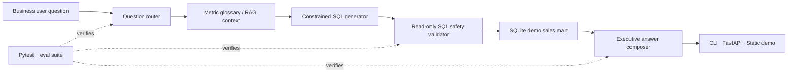

# Agentic BI Copilot

A production-style AI engineering portfolio project: an agentic business-intelligence copilot that turns natural-language analytics questions into safe SQL, explains the answer, and grows into a RAG + evaluation + API product over one focused week.

## Why this project matters

Modern AI engineering roles increasingly expect more than a chatbot demo. This repository is designed to demonstrate:

- **Agentic workflow design** for planning, SQL generation, validation, execution, and explanation.
- **NL2SQL over a realistic analytics mart** with safety checks and reproducible sample data.
- **RAG-backed metric definitions** so business terms are grounded in documented context.
- **LLM evaluation discipline** with deterministic regression tests and answer-quality checks.
- **Production packaging** through FastAPI, Docker, CI, and portfolio-ready documentation.

## Recruiter-facing summary

Agentic BI Copilot is a compact proof that I can turn an ambiguous business question into a governed analytics product, not just a prompt demo. The project shows a reviewer that I can:

- Design an agent-style loop with routing, metric retrieval, SQL generation, SQL safety checks, execution, and answer composition.
- Ground business language in a curated metric glossary so generated answers cite definitions, formulas, and grains.
- Back every supported question with deterministic tests, an eval runner, and CLI/API smoke paths that can be re-run locally.
- Package the same answer path for a command line, FastAPI service, and static HTML portfolio demo.

## Recruiter review path

For a quick technical screen, this repo is designed to be reviewed in minutes rather than inferred from code alone:

| What to review | Command or artifact | What it proves |
| --- | --- | --- |
| Supported use cases | `uv run python -m agentic_bi_copilot.cli --list-questions` | The copilot has an explicit question registry instead of accepting every prompt blindly. |
| Deterministic quality gate | `uv run python -m agentic_bi_copilot.cli --run-evals` | Every supported question is checked for SQL safety, expected rows, answer text, and metric citations. |
| End-to-end answer path | `uv run python -m agentic_bi_copilot.cli "What is revenue by region?" --limit 2` | Natural language is routed to safe SQL, executed on the demo mart, and returned with grounded BI context. |
| API contract | `uv run --group dev pytest tests/test_api.py -q` | FastAPI health, question listing, answer responses, OpenAPI examples, and unsupported-question errors are covered. |
| Local portfolio demo | [`docs/demo.html`](docs/demo.html) | The same deterministic answer path is packaged as a self-contained UI artifact for walkthroughs. |

The narrative for hiring teams: **Agentic BI Copilot is a production-minded AI engineering slice**. It scopes the assistant to supported analytics tasks, grounds business terminology in a metric glossary, validates SQL before execution, exposes repeatable CLI/API/UI surfaces, and measures answer quality with deterministic evals.

## Current milestone

The current milestone is a deterministic offline analytics path with grounded metric-definition context, FastAPI endpoints, a static portfolio demo page, recruiter-ready architecture documentation, and production packaging through Docker plus GitHub Actions CI:

```bash
uv run --group dev pytest tests/ -q
uv run python -m agentic_bi_copilot.cli --list-questions
uv run python -m agentic_bi_copilot.cli --run-evals
uv run --group dev pytest tests/test_api.py -q
uv run python -m agentic_bi_copilot.cli --render-demo docs/demo.html --db-path examples/demo_page.sqlite --limit 2
docker build -t agentic-bi-copilot .
docker run --rm agentic-bi-copilot
docker run --rm agentic-bi-copilot "What is revenue by region?" --limit 2
uv run python -m agentic_bi_copilot.cli "Which customer segment has the highest revenue?"
uv run python -m agentic_bi_copilot.cli "What is revenue by region?" --limit 4
uv run python -m agentic_bi_copilot.cli "What is the repeat customer rate?" --limit 1
uv run python -m agentic_bi_copilot.cli "What is product category mix by revenue?" --limit 4
```

Expected behavior: the copilot lists supported sample questions, builds a local demo sales mart, generates safe read-only SQL, retrieves curated BI metric definitions, returns ranked segment or region revenue, calculates a repeat-customer KPI, summarizes product/category revenue mix, cites the metric context used in each answer with source snippets, runs a deterministic evaluation suite that checks supported-question coverage, SQL safety, expected rows, metric context, answer text, evaluation quality status, and graceful failure reporting, exposes the same deterministic answer path through FastAPI health, sample-question, and ask-question endpoints, renders a self-contained `docs/demo.html` page with architecture proof points for local portfolio demos without extra UI dependencies, packages the CLI in a Docker image whose default command lists supported questions and whose entrypoint accepts normal question arguments, and runs GitHub Actions checks for pytest, CLI smoke output, and Docker build/run smoke coverage.

## Metric glossary / RAG context

Metric definitions live in [`docs/metric_glossary.md`](docs/metric_glossary.md) and are mirrored by a deterministic retriever in `src/agentic_bi_copilot/metrics.py`. The offline answer path attaches matching `MetricDefinition` cards to `AnalysisResult.metric_context` and cites each retrieved definition with a stable glossary anchor plus a source snippet containing definition, formula, and grain. This provides a small RAG-style grounding layer for terms like revenue, repeat customer rate, active customer, product category mix, and average order value.

## CLI example: evaluation suite

```bash
uv run python -m agentic_bi_copilot.cli --run-evals
```

Expected deterministic report:

```text
Evaluation report: 4/4 passed
Quality summary: PASS (100.0% pass rate, 0 failing cases)
- segment_revenue: PASS
- region_revenue: PASS
- repeat_customer_rate: PASS
- product_category_mix: PASS
```

The evaluation dataset lives in `evals/supported_questions.json` and covers every supported sample question. The runner in `src/agentic_bi_copilot/evaluation.py` builds the demo mart when needed, executes the same safe offline answer path, and scores SQL safety, expected SQL fragments, deterministic rows, metric context, and answer text fragments. The formatted report includes a quality status line with pass rate and failing case IDs so CI logs and portfolio demos show a quick go/no-go summary before per-case details.

## Evaluation quality gates and failure handling

See [`docs/evaluation_quality.md`](docs/evaluation_quality.md) for the evaluation report contract. In short:

- `PASS` means every deterministic case executed successfully and all scoring checks passed.
- `FAIL` means at least one case either failed execution or missed an expected SQL, row, answer, or metric-context check.
- Unsupported or broken questions are captured as failed `EvaluationCaseResult` records instead of crashing the full suite, preserving the case ID, question, failed execution check, and exception message for debugging.

## API example: FastAPI answer flow

The ASGI app is exposed as `agentic_bi_copilot.api:app` for local API demos and any ASGI server. See [`docs/api.md`](docs/api.md) for cURL-ready request/response examples, the unsupported-question error contract, and local smoke-test guidance. Its deterministic endpoints are:

- `GET /health` — readiness payload with service name and supported-question count.
- `GET /questions` — the sample-question registry used by the CLI.
- `POST /ask` — request body `{"question": "What is revenue by region?", "limit": 2}` and response with generated SQL, rows, answer text, and cited metric context.

The API path builds the same demo sales mart when its configured SQLite file is missing, then reuses the safe SQL and metric-glossary answer flow covered by the CLI and eval tests. The OpenAPI schema includes request/response examples for `/ask`, and unsupported prompts return a structured `400` with supported sample questions instead of an unhandled server error.

## Static UI demo

[`docs/demo.html`](docs/demo.html) is a self-contained local portfolio page generated from the same deterministic answer path. It highlights the supported-question menu, safe SQL, result table, metric-context citation, architecture proof points, and the CLI/API commands a reviewer can run locally.

Regenerate the demo page after answer-path changes:

```bash
uv run python -m agentic_bi_copilot.cli --render-demo docs/demo.html --db-path examples/demo_page.sqlite --limit 2
```

The SQLite file is an ignored local artifact; only the HTML page is intended to be committed.

## CLI example: revenue by region

```bash
uv run python -m agentic_bi_copilot.cli "What is revenue by region?" --limit 4
```

Expected deterministic rows:

```text
region | revenue
--- | ---
North | 4200.0
West | 3000.0
South | 1500.0
East | 800.0
```

The generated SQL groups by `c.region`, orders by revenue descending, and passes the same read-only safety gate used by the segment revenue question.

## CLI example: repeat customer rate

```bash
uv run python -m agentic_bi_copilot.cli "What is the repeat customer rate?" --limit 1
```

Expected deterministic rows:

```text
total_customers | repeat_customers | repeat_customer_rate
--- | --- | ---
6 | 2 | 33.33
```

The metric treats customers with more than one order as repeat customers, so the offline sales mart reports 2 repeat customers out of 6 total customers, or a 33.33% repeat-customer rate.

## CLI example: product/category mix

```bash
uv run python -m agentic_bi_copilot.cli "What is product category mix by revenue?" --limit 4
```

Expected deterministic rows:

```text
category | revenue | units_sold | revenue_share_pct
--- | --- | --- | ---
Data Engineering | 3250.0 | 5 | 34.21
Software | 3000.0 | 3 | 31.58
AI | 1800.0 | 3 | 18.95
Services | 1450.0 | 8 | 15.26
```

The generated SQL groups by `p.category`, computes each category's share of total demo revenue, orders by revenue descending, and keeps the same safe read-only execution path as the other offline analytics questions.

## One-week build roadmap

See [`docs/roadmap.md`](docs/roadmap.md) for the daily milestone plan. The goal is to complete a polished AI engineering portfolio project in one week with two verified commits per day.

## Architecture at a glance

See [`docs/architecture.md`](docs/architecture.md) for the expanded architecture notes, diagrams, verification loop, and production extension plan.



Reviewer proof points:

- `src/agentic_bi_copilot/sql_agent.py` separates routing, SQL generation, validation, execution, metric-context retrieval, and answer composition.
- `evals/supported_questions.json` plus `uv run python -m agentic_bi_copilot.cli --run-evals` provide deterministic quality gates for supported questions.
- `src/agentic_bi_copilot/api.py` and `src/agentic_bi_copilot/demo.py` expose the same core answer path through API and static portfolio surfaces.

## Repository layout

```text
src/agentic_bi_copilot/   Python package
  data.py                 Deterministic demo sales mart builder
  sql_agent.py            Safe NL2SQL, metric retrieval, and answer composition path
  metrics.py              Curated BI metric glossary retriever
  questions.py            Supported sample-question registry
  evaluation.py           Deterministic eval runner for supported questions
  cli.py                  Local command-line smoke path
  api.py                  FastAPI health, sample-question, and ask-question endpoints
  demo.py                 Static HTML portfolio demo renderer
evals/                    Supported-question evaluation datasets
tests/                    Regression tests
docs/                     Roadmap, API contract, static demo, metric glossary, evaluation quality, and architecture notes
examples/                 Local generated demo databases, ignored by git
.github/workflows/ci.yml  GitHub Actions pytest, CLI smoke, and Docker smoke checks
Dockerfile                Runtime container for the CLI smoke path
.dockerignore             Build-context guard for local DB, venv, cache, and secret files
```
