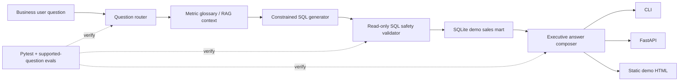
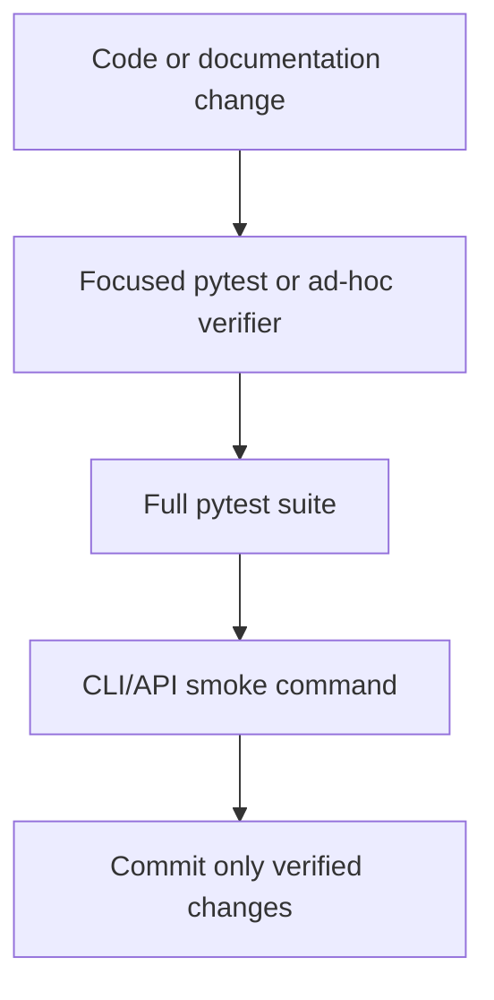

# Architecture Notes

Agentic BI Copilot is intentionally small enough to run locally, but it is structured like a production analytics assistant: route a business question, retrieve metric context, generate constrained SQL, validate it, execute against a reproducible mart, and return an answer with cited evidence.

## System overview

## Request lifecycle

1. **Question intake and routing** — `questions.py` defines the supported business-question registry, and `sql_agent.py` maps natural-language prompts to deterministic answer plans.
2. **Metric context retrieval** — `metrics.py` retrieves glossary cards such as revenue, repeat customer rate, average order value, and product category mix. Each card includes definition, formula, grain, source, and source snippet.
3. **Constrained SQL generation** — the answer plan emits a read-only SQL statement for the selected business question rather than free-form database access.
4. **SQL safety validation** — the safety gate rejects non-`SELECT` statements and blocks mutating SQL before execution.
5. **Reproducible analytics mart execution** — `data.py` builds a local SQLite sales mart so demos, tests, and evals run without external services or secrets.
6. **Executive answer composition** — the answer layer returns rows, SQL, human-readable summary text, and cited metric-context snippets.
7. **Delivery surfaces** — the same core answer path powers the CLI, FastAPI endpoints, generated `docs/demo.html` portfolio page, and final completion-checklist handoff.

## Verification loop

Verification artifacts are deliberately visible to reviewers:

- `tests/` covers data generation, supported questions, SQL safety, metric context, evaluation behavior, API contracts, CLI behavior, and static demo rendering.
- `evals/supported_questions.json` defines deterministic answer-quality checks for each supported question.
- `uv run python -m agentic_bi_copilot.cli --run-evals` prints a concise quality-gate report for demos and CI logs.
- `uv run python -m agentic_bi_copilot.cli --completion-checklist` reruns the evals and prints final portfolio readiness status, delivery surfaces, completed milestones, reviewer commands, and the milestone-to-evidence handoff for screening.
- `docs/demo.html` now includes architecture proof points so a recruiter can connect the UI artifact back to the tested backend path.

## Why this design is market-relevant

- **Governed NL2SQL:** business prompts are routed to safe, testable SQL instead of unrestricted query generation.
- **Grounded metrics:** answers cite a glossary source so stakeholders can see how terms like revenue and repeat customer rate are defined.
- **Evaluation-first delivery:** every supported question has deterministic checks for SQL fragments, result rows, metric citations, and answer text.
- **Product-shaped packaging:** CLI, API, and static demo surfaces show how the same core service can move from local prototype to deployable app.

## Production extension path

The deterministic offline implementation leaves clear seams for production upgrades:

1. Replace the rule-based router with an LLM planner while keeping the same answer-plan contract.
2. Swap SQLite for DuckDB/Postgres and add warehouse credential handling outside source control.
3. Expand the metric glossary into a document index with retrieval scoring and citation metadata.
4. Add tracing around routing, SQL generation, validation failures, and answer composition.
5. Containerize the API and run the full pytest/eval/smoke loop in CI before release.
